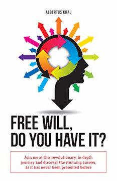
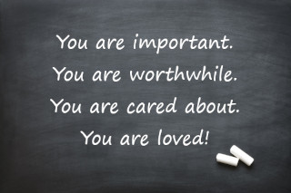

<!DOCTYPE html>
<html lang="en">
    <head>
        <meta charset="UTF-8">
        <title>Little House - Home</title>
        <meta name="viewport" content="width=device-width, initial-scale=1">
        <meta name="description" content="Little House Residential Care Services Inc. Childrens Services including Individual Treatment/Therapy, Anger & Behaviour Management, Assertiveness Training, Long Term Residential Care.">
        <meta name="author" content="Little House Residential Care Services Inc.">
        <!-- Bootstrap CSS -->
        <link href="https://cdn.jsdelivr.net/npm/bootstrap@5.0.0-beta2/dist/css/bootstrap.min.css" rel="stylesheet" integrity="sha384-BmbxuPwQa2lc/FVzBcNJ7UAyJxM6wuqIj61tLrc4wSX0szH/Ev+nYRRuWlolflfl" crossorigin="anonymous">
        <!-- Google CSS -->
        <link rel="stylesheet" href="https://fonts.googleapis.com/css?family=Schoolbell">
        <link rel="stylesheet" type="text/css" href="css/littlehouse.css">
    </head>
    <body>
        <header class="dropShadow">
            <h1>Little&nbsp;House&nbsp;Residential&nbsp;Care&nbsp;Services&nbsp;Inc.</h1>
            <nav>
                <ul>
                    <li><a href="index.html">Home</a></li>
                    <li><a href="#">About</a></li>
                    <li><a href="#">Services</a></li>
                    <li><a href="#">Contact</a></li>
                </ul>
            </nav>
        </header>
        <main>
            <!-- Start Bootstrap Carousel -->
            

                

                    

                        <button type="button" data-bs-target="#carouselExampleIndicators" data-bs-slide-to="0" class="active" aria-current="true" aria-label="Slide 1"></button>
                        <button type="button" data-bs-target="#carouselExampleIndicators" data-bs-slide-to="1" aria-label="Slide 2"></button>
                        <button type="button" data-bs-target="#carouselExampleIndicators" data-bs-slide-to="2" aria-label="Slide 3"></button>
                    

                    

                        

                            

                                <!--Begin Section 1-->
                                <section class="section1">
                                    <h1>
                                    <a href="https://www.crisisprevention.com/Blog/January-2017/Unrestrained-Episode-36-Guest-Albertus-Kral" target="_blank" title="Listen at www.crisisprevention.com">Unrestrained Podcast - Episode 36, Guest:&nbsp;Albertus&nbsp;Kral</a>
                                    </h1>
                                    <figure>
                                    
                                    <figcaption>
                                        To listen to more podcasts from experts on very interesting topics please visit the <a href="https://www.crisisprevention.com/" title="Visit the Crisis Prevention Institute to explore more episodes.">Crisis&nbsp;Prevention&nbsp;Institute.</a>
                                    </figcaption>
                                    </figure>
                                </section>
                                <!--End Section 1-->
                            

                        

                        

                            

                                <!--Begin Section 2-->
                                <section class="section2">
                                    

                                        <a href="https://www.amazon.com/Why-Procirclism-Albertus-Kral-ebook/dp/B07BR9NP9Z/ref=sr_1_1?dchild=1&keywords=free+will+do+you+have+it+albertus+kral&qid=1614305322&sr=8-1" target="_blank" title="Visit Amazon.com">
                                            
                                        </a>
                                    

                                    

                                        
The most asked question by young and old, anywhere in the world, is most likely this one syllable word:

                                        
<strong>&quot;Why?&quot;</strong>

                                        
&quot;Free Will, Do You Have It?&quot; by Albertus Kral, available on <a href="https://www.amazon.com/Why-Procirclism-Albertus-Kral-ebook/dp/B07BR9NP9Z/ref=sr_1_1?dchild=1&keywords=free+will+do+you+have+it+albertus+kral&qid=1614305322&sr=8-1" target="_blank" title="Visit Amazon.com">Amazon.com.</a>

                                    

                                </section>
                                <!--End Section 2-->
                            

                        

                        

                            

                                <!-- Begin Section 3 -->
                                <section class="section3">
                                    <h1>Section 3</h1>
                                </section>
                                <!-- End Section 3 -->
                            

                        

                    

                    <button class="carousel-control-prev" type="button" data-bs-target="#carouselExampleIndicators"  data-bs-slide="prev">
                        
                        Previous
                    </button>
                    <button class="carousel-control-next" type="button" data-bs-target="#carouselExampleIndicators"  data-bs-slide="next">
                        
                        Next
                    </button>
                

            

            <!-- End Bootstrap Carousel -->
            <section class="section4">
                <h1>Little House Residential Care Services Inc.</h1>
                
Little House Residential Care Services Inc. was founded in 1999 by Albert &amp; Bernice Kral. Although we are the administrators we remain involved with the children in our organization and establish a trusting personal relationship with each child. We feel honoured to be part of their life. We believe that the building of healthy, trusting and lasting relationships with the children is of paramount importance. The professional atmosphere in our organization rests on the corner stones of honesty, mutual respect and support.

                <h1>We Provide Enhanced Family Based Care</h1>
                
Little House provides <strong>Enhanced Family Based Care</strong> to children and youth who, for whatever reason, cannot live with their family anymore. Structure in our families is provided with compassion. Routines in the family include but is not limited to educational as well as recreational activities, regular house chores, development of life and social skills, family shopping, day and summer vacation trips.

                
<strong>We serve the needs of Developmentally Challenged, Emotionally Disturbed, Behavioural Disordered and Autistic children/youth.</strong> We invite the children's parents to actively participate in the child's treatment and, if desired, will closely work with them. We provide short and long term care and we will soon be able to provide care for those turning 18 years of age and require continued care. We also have a section classroom for students who benefit from such a supportive and structured educational environment.

                
<strong>We are often able to customize our services to the unique needs of children and youth with specific and special personal needs.</strong>

                <h1>We Are Guided By Our Mission Statement</h1>
                
We are committed to <strong>create an atmosphere</strong> in our homes and organization, for the children who live here, that <strong>cultivates feelings of acceptance, belonging, safety and being loved.</strong> We try to accomplish such in a family environment where <strong>structure is being applied with compassion to inspire, stimulate, encourage and guide</strong> each child to reach his/her highest potential of personal integrity, but also social and vocational happiness and accomplishments. <strong>We will encourage</strong> each child to reach a level of joy and wholeness through spiritual development.

                <h1>This Is How We Achieve Our Goal</h1>
                
We believe that through the establishment of quality, mutual satisfying relationships we are able to build a foundation of trust. Sincere care and compassion is a requirement for such to take place. As we approach children and youth, with acting out behaviour, the same way as children and youth, with learning disabilities, our focus centers on <strong>teaching</strong> skills they are lacking rather than consequences and punishment. We will take all the time it takes and provide <strong>stability</strong> for the child/youth in the process. We believe the child/youth must take center stage and all services must be focused around their needs in order to be successful. Their needs must direct the treatment and plan of care, failure of which will lead to instability, insecurity, confusion and misguided, ineffective care.

            </section>
            <section class="section5">
                <h1>The Message We Want to Send to Children &amp; Youth In Our Care</h1>
                

                    

                        
We make every effort, through our actions, verbal and non-verbal communication as well as through messaging, to write on the child's/youth's mental blackboard:

                        <blockquote><strong>You are important, you are worthwhile, you are significant, you are cared about, you are loved.</strong></blockquote>
                    

                    

                        
                    

                

            </section>
        </main>
  <footer>
    
Copyright © 2021 Little House Residential Care Services Inc.

    <nav>
      <ul>
          <li><a href="#">Home</a></li>
          <li><a href="#">About</a></li>
          <li><a href="#">Services</a></li>
          <li><a href="#">Contact</a></li>
      </ul>
    </nav>
  </footer>
        <!-- Bootstrap Bundle with Popper -->
        
    </body>
</html>
© 2021 GitHub, Inc.
Terms
Privacy
Security
Status
Docs
Contact GitHub
Pricing
API
Training
Blog
About
